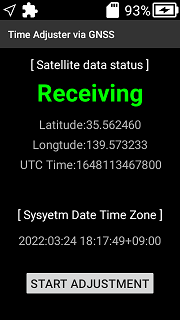

# Time Adjuster via GNSS

より詳しい日本語の説明は[こちら](https://qiita.com/KA-2/items/7b27979ebeacb86b2295)。<br>
[Click here](https://qiita.com/KA-2/items/7b27979ebeacb86b2295) for a more detailed explanation in Japanese.

# 1. Overview



When you press the "START ADJUSTMENT" button in a place where you can receive radio waves emitted from the Global Navigation Satellite System(GNSS), the time of the camera will be adjusted.

If you press the "START ADJUSTMENT" button in a place where radio waves cannot be received, the time will be set when the radio waves are received.

If you continue to be unable to receive radio waves, you can cancel the reserved adjustment status by pressing the "STOP ADJUSTMENT" button.


[NOTE]

- Time adjustment using GNSS can be performed only when this plug-in is running. It doesn't work in the background.
- To set the time with this plug-in, check that the following two settings are valid from the menu UI.<br>Check Point 1 : "position information addition function" is On.<br>Check Point 2 : "Date / time setting"-> "Auto" is On.


# 2. Terms of Service

> You agree to comply with all applicable export and import laws and regulations applicable to the jurisdiction in which the Software was obtained and in which it is used. Without limiting the foregoing, in connection with use of the Software, you shall not export or re-export the Software  into any U.S. embargoed countries (currently including, but necessarily limited to, Crimea  Region of Ukraine, Cuba, Iran, North Korea, Sudan and Syria) or  to anyone on the U.S. Treasury Departmentﾂ’s list of Specially Designated Nationals or the U.S. Department of Commerce Denied Personﾂ’s List or Entity List. By using the Software, you represent and warrant that you are not located in any such country or on any such list. You also agree that you will not use the Software for any purposes prohibited by any applicable laws, including, without limitation, the development, design, manufacture or production of missiles, nuclear, chemical or biological weapons.

By using the Time Adjuster via GNSS plug-in, you are agreeing to the above and the license terms, [LICENSE.txt](LICENSE.txt).

Copyright &copy; 2022 Ricoh Company, Ltd.

# 3. Development Environment

* RICOH THETA X 
* Firmware version 1.00.2 or later


# 4. Install
Android Studio install apk after build automatically. Or use the following command after build.

```
adb install -r app-debug.apk
```

To see the plug-ins installed on the "plug-in selection screen", turn the camera off-> on or restart the camera using the following command.

```
adb reboot
```


# 5. How to Use

1. Turn on the THETA.
2. After displaying "plug-in selection screen", tap "Time Adjuster via GNSS" to start this plug-in.


# 6. History
* ver.1.0.0 (2022/03/25): Initial version.

---

## Trademark Information

The names of products and services described in this document are trademarks or registered trademarks of each company.

* Android, Nexus, Google Chrome, Google Play, Google Play logo, Google Maps, Google+, Gmail, Google Drive, Google Cloud Print and YouTube are trademarks of Google Inc.
* Apple, Apple logo, Macintosh, Mac, Mac OS, OS X, AppleTalk, Apple TV, App Store, AirPrint, Bonjour, iPhone, iPad, iPad mini, iPad Air, iPod, iPod mini, iPod classic, iPod touch, iWork, Safari, the App Store logo, the AirPrint logo, Retina and iPad Pro are trademarks of Apple Inc., registered in the United States and other countries. The App Store is a service mark of Apple Inc.
* Microsoft, Windows, Windows Vista, Windows Live, Windows Media, Windows Server System, Windows Server, Excel, PowerPoint, Photosynth, SQL Server, Internet Explorer, Azure, Active Directory, OneDrive, Outlook, Wingdings, Hyper-V, Visual Basic, Visual C ++, Surface, SharePoint Server, Microsoft Edge, Active Directory, BitLocker, .NET Framework and Skype are registered trademarks or trademarks of Microsoft Corporation in the United States and other countries. The name of Skype, the trademarks and logos associated with it, and the "S" logo are trademarks of Skype or its affiliates.
* Wi-Fi, Wi-Fi Certified Miracast, Wi-Fi Certified logo, Wi-Fi Direct, Wi-Fi Protected Setup, WPA, WPA 2 and Miracast are trademarks of the Wi-Fi Alliance.
* The official name of Windows is Microsoft Windows Operating System.
* All other trademarks belong to their respective owners.
